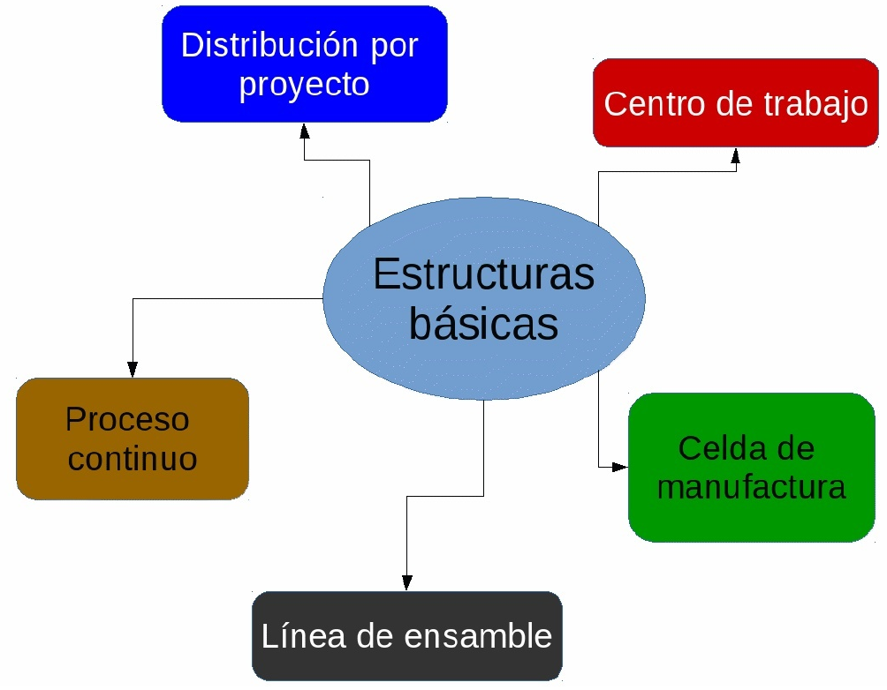
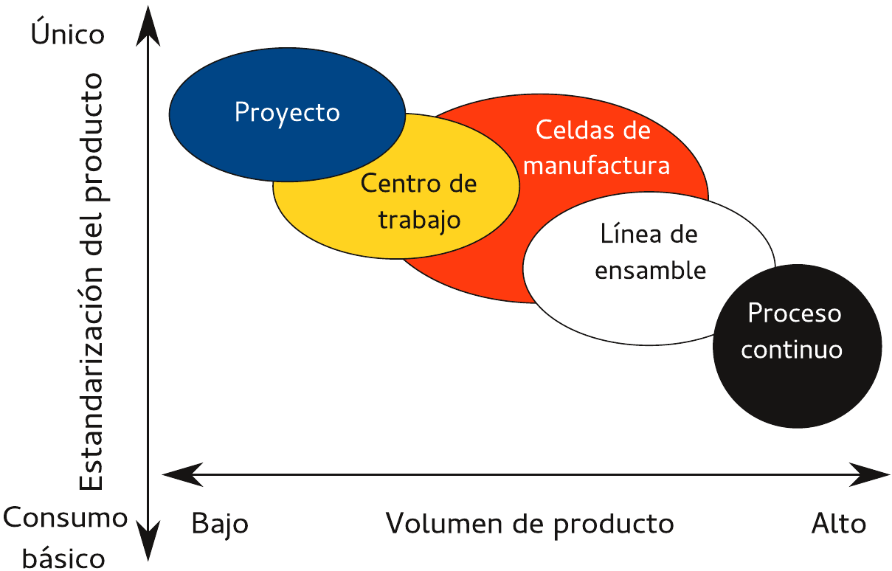

# Bienvenidos {.r-fit-text}

¿Alguna vez te has preguntado cómo llega tu café, tu celular o tus zapatos a tus manos?

Detrás de cada producto hay un mundo de decisiones, procesos y estrategias.

**Hoy empezamos a desmenuzar ese mundo.**

---

## ¿Qué veremos en esta unidad?

1.  **Antecedentes e Historia:** De dónde venimos y quiénes nos precedieron.
2.  **Concientización e Importancia:** Por qué esto es más relevante que nunca.
3.  **Sistemas de Producción:** Feudal, Americano, Europeo y otros.

**Objetivo final:** Que puedas mirar cualquier producto y entender el *sistema* que lo hizo posible.

# Parte 1: Antecedentes e Historia {.r-fit-text}

## "Los padres fundadores de la producción"

Para entender el presente, debemos viajar al pasado. La administración de la producción no nació con las computadoras, sino con la necesidad humana de **organizarse para sobrevivir**.

---

### La Prehistoria: El primer "Jefe de Producción"

-   **Factor clave:** **La supervivencia**.
-   **El rol:** El cazador más experimentado o el líder de la tribu.
-   **Actividad:** Planificar la cacería, asignar roles (los que espantan, los que acechan, los que rematan) y distribuir la comida.

---

### ¿Qué interviene aquí?

-   **Mano de obra:** Los cazadores.
-   **Materia prima:** Los animales.
-   **Herramientas:** Lanzas y piedras.
-   **Organización:** La estrategia de caza.
-   **Resultado:** Alimento para la tribu (producto).

---

### Antiguas Civilizaciones: El nacimiento de la estandarización

-   **Egipto:** Construcción de las pirámides. **Factor clave:** **Logística y mano de obra masiva**. Coordinación de decenas de miles de trabajadores, con turnos, almacenes de alimentos y herramientas estandarizadas.
-   **Mesopotamia:** Los sumerios inventan la escritura para llevar cuentas de los granos. **Factor clave:** **Control de inventarios**. ¿Cuánto tengo? ¿Cuánto debo?
-   **China:** Construcción de la Muralla China. **Factor clave:** **Estandarización de materiales** (ladrillos de tamaño uniforme para que encajaran en cualquier tramo).

---

### La Revolución Industrial (Siglo XVIII - XIX): El gran cambio {.r-fit-text}

-   **Factor clave:** **La máquina a vapor**. La energía humana y animal da paso a la energía mecánica.
-   **El sistema:** Nacen las **fábricas**. Se centraliza la producción en un solo lugar.
-   **El problema:** Los artesanos (que hacían todo) son reemplazados por obreros (que hacen una parte). ¿Cómo gestionar a cientos de personas haciendo tareas repetitivas?

---

### Los "Visionarios": Los padres de la administración científica

Aquí es donde la administración de la producción se convierte en una **ciencia**.

1.  **Adam Smith (1776):** Especialización del trabajo.
    -   *Ejemplo:* Si un herrero hace un clavo entero, produce pocos. Si 10 herreros se especializan en una parte del clavo, producen miles.

2.  **Charles Babbage:** Padre de la computadora. Propuso la "división del trabajo mental". Separar la planeación (ingenieros) de la ejecución (obreros).

3.  **El gran MÉTODO CIENTÍFICO:**

---

### Frederick Winslow Taylor (1856-1915) - El padre de la Administración Científica {.r-fit-text}

Taylor dijo: *"No hay pereza, hay mala organización"*.

**Sus 4 principios:**

1.  **Estudiar el trabajo:** Cronometrar cada movimiento (estudio de tiempos y movimientos).
2.  **Seleccionar al obrero:** Elegir al mejor para cada tarea.
3.  **Entrenar:** Enseñar la forma "correcta" de hacerlo.
4.  **Cooperación:** Patrón y obrero deben tener el mismo objetivo (más producción = más paga).

---

### Henry Ford (1863-1947) - La producción en masa

-   **Factor clave:** **La línea de ensamble móvil** (1913).
-   **¿Qué hizo?** Redujo el tiempo de ensamble de un auto de 12 horas a **93 minutos**.
-   **Sus aportes:**
    -   **Estandarización:** Todas las piezas son intercambiables.
    -   **Flujo continuo:** El producto va al trabajador, no al revés.
    -   **Salarios altos:** Pagó a sus obreros el doble (\$5 al día) para que pudieran comprar sus propios autos (creó el mercado).

# Parte 2: Concientización e Importancia {.r-fit-text}

## ¿Por qué debería importarme esto?

---

### La producción es el corazón de cualquier negocio

Sin producción (de bienes o servicios), no hay producto. Sin producto, no hay venta. Sin venta, no hay empresa.

La administración de la producción es el arte de **hacer más con menos**, y eso se traduce en:

-   **Más ganancias.**
-   **Mejor calidad.**
-   **Clientes más felices.**

---

| Época | Enfoque | Objetivo |
| :--- | :--- | :--- |
| **Artesanal** | El maestro hace todo. | Satisfacer a un cliente específico. |
| **Revolución Industrial** | Máquinas y fábricas. | Producir mucho y rápido. |
| **Taylorismo/Fordismo** | Tiempos y línea de ensamble. | Estandarizar y bajar costos. |
| **Toyotismo (1960s)** | Calidad y flexibilidad. | Producir justo a tiempo. |
| **Actualidad (Industria 4.0)** | Datos e IA. | Sistemas que aprenden y se adaptan. |

---

### ¿Qué significa esta evolución para ti?

-   **Antes (Taylor):** El obrero era una extensión de la máquina.
-   **Después (Toyota):** El obrero es un solucionador de problemas. Si ve una pieza defectuosa, *detiene la línea* (Jidoka).
-   **Ahora (IA):** La máquina predice cuándo se va a descomponer (mantenimiento predictivo) y el humano toma decisiones estratégicas.

**Conclusión:** La administración de la producción evolucionó de **"explotar la fuerza"** a **"optimizar el conocimiento"**.

# Parte 3: Antecedentes de los Sistemas de Producción {.r-fit-text}

## Un viaje por el mundo: Feudal, Americano y Europeo

---

### Sistema Feudal (Sistema Señorial / Taller Medieval)

-   **Contexto:** Europa, Edad Media (Siglos IX-XV).
-   **La unidad productiva:** El feudo (tierra del señor).
-   **La organización:**
    -   **Señor feudal:** Dueño de la tierra y los recursos.
    -   **Siervos/Campesinos:** Trabajan la tierra a cambio de protección.
    -   **Artesanos (Gremios):** Controlados por gremios que regulaban precios, calidad y secretos del oficio.
-   **Característica principal:** Se produce para consumir dentro del feudo. Poco o nulo comercio exterior.

---

### Sistema Feudal: Factores que intervienen

-   **Factor 1: Tierra (Factor dominante).** Sin tierra, no hay producción.
-   **Factor 2: Trabajo manual (Poca tecnología).** El arado de madera era la "máquina estrella".
-   **Factor 3: Control social (Gremios).** Restricción a la innovación (el maestro guardaba el secreto de su oficio para no tener competencia).
-   **Factor 4: Mercado local (Ineficiente).** Si la cosecha era mala, morían de hambre, no podían "importar" fácilmente.

---

### Sistema Americano (EEUU, principios del Siglo XX) {.r-fit-text}

-   **La unidad productiva:** La gran fábrica (Detroit).
-   **La organización:**
    -   **Gerente:** Planifica y controla (separación de la ejecución).
    -   **Obrero:** Ejecuta tareas simples y repetitivas.
    -   **Máquina:** Herramienta especializada (hace una sola cosa, pero la hace rápido).
-   **Característica principal:** **Estandarización y Economías de Escala.** Producir millones de unidades idénticas al menor costo posible.

---

### Sistema Americano: Factores que intervienen

-   **Factor 1: Recursos naturales abundantes.** EEUU tenía hierro, petróleo y carbón.
-   **Factor 2: Mano de obra inmigrante.** Mano de obra barata y abundante.
-   **Factor 3: Mercado masivo.** Una clase media en crecimiento con ansias de consumo.
-   **Factor 4: Mentalidad "Idea - Prototipo - Producción".** Rápida innovación.
-   **Ventaja:** Precios ultra bajos.
-   **Desventaja:** Inflexibilidad (el modelo T era solo negro).

---

### Sistema Europeo (Modelo Diversificado / Flexible)

-   **Contexto:** Europa Occidental (Alemania, Italia, Suecia), post Segunda Guerra Mundial y hasta hoy.
-   **La unidad productiva:** La fábrica *enfocada en calidad* y la *especialización flexible*.
-   **Característica principal:** **Alta calidad y personalización.**
    -   **Ejemplo: BMW (Alemania):** No hacen una línea solo para un modelo, tienen sistemas flexibles que permiten ensamblar diferentes autos en la misma línea.
    -   **Ejemplo: Moda Italiana:** Alta costura, producción por lotes pequeños para mercados exclusivos.

---

### Sistema Europeo: Factores que intervienen

-   **Factor 1: Recursos escasos.** Productos de *alto valor agregado* porque no se tenía materia prima barata.
-   **Factor 2: Mano de obra calificada (cara).** Al ser caros, invierten en tecnología para que cada hora de trabajo valga mucho (robotización).
-   **Factor 3: Mercado fragmentado.** Muchos países cerca, con gustos distintos (ej: Francia, Italia, Alemania). Obliga a la flexibilidad.
-   **Factor 4: Estado de Bienestar.** Fuertes sindicatos y leyes laborales, lo que obliga a invertir en ergonomía y mejorar las condiciones.

---

| Característica | Feudal | Americano | Europeo |
| :--- | :--- | :--- | :--- |
| **Unidad base** | El feudo | Línea de ensamble | Red de proveedores |
| **Objetivo** | Subsistencia | Bajar costos | Calidad y variedad |
| **Tecnología** | Herramientas simples | Máquinas rígidas | Máquinas CNC y robots |
| **Mano de obra** | Poco calificada | Especializada | Polivalente |
| **Innovación** | Lenta | Rápida | Constante |

---

## ¿Cuál es mejor?

**No hay uno "mejor", hay uno "más adecuado".**

-   Si necesitas 10 millones de cucharas de plástico baratas al mes → **Sistema Americano**.
-   Si necesitas 500 piezas de joyería de lujo → **Sistema Europeo**.
-   Si estás en una comunidad aislada sin acceso a internet → **Sistema Feudal**.

---

El reto de la administración moderna es **mezclar lo mejor de cada uno**:

-   La *eficiencia* de Ford.
-   La *calidad* de Europa.
-   La *agilidad* para responder (como en el feudalismo, pero a los clientes, no al señor).

# Parte 4: Sistemas y Estrategias de Producción {.r-fit-text}

## Procesos de producción

Una panorámica muy general sobre lo que se requiere para fabricar algo se divide en tres pasos sencillos:

1.  Solicitar a un proveedor las piezas necesarias (Fuente).
2.  Manufactura física del producto (Fabricar).
3.  Envío al cliente (Entregar).

---

### Estrategias de producción

Según la estrategia de la empresa, su capacidad de manufactura y las necesidades de sus clientes, estas actividades se organizan para reducir al mínimo el costo sin dejar de satisfacer las prioridades competitivas necesarias para atraer pedidos de clientes.

Abordaremos cuatro de estas estrategias, a saber:

-   Fabricar para existencias.

-   Ensamblar por pedido.

-   Fabricar por pedido.

-   Diseño por orden.

---

### Fabricar para existencias

Existen productos cuya fabricación llega a su forma final y se almacenan como artículos terminados. La base colectiva de clientes puede tener cierta influencia sobre el diseño general en una fase temprana del bosquejo del producto; sin embargo, un cliente individual solo tiene que tomar una decisión cuando el producto está terminado: adquirirlo o no.

---

### Ensamblar por pedido

El cliente cuenta con mayor influencia sobre el diseño, toda vez que puede seleccionar varias opciones a partir de subarmados predefinidos. El productor ensamblará esas opciones para formar el producto final que desea el cliente.

La base colectiva de clientes puede influir sobre el diseño general de las opciones y productos finales, pero el cliente individual solo puede hacer su elección a partir de las opciones especificadas.

---

### Fabricar por pedido

Esta condición permite que el cliente especifique el diseño exacto del producto o servicio final, siempre y cuando en su fabricación se utilicen materias primas y componentes estándar.

### Diseño por orden

En este caso, el cliente tiene prácticamente completo poder de decisión sobre el diseño del producto o servicio. En general, no se verá limitado a la utilización de componentes o materia prima estándar, sino que incluso podrá hacer que el productor le entregue algo diseñado desde cero.

---

## Punto de desacoplamiento de pedido {.scrollable}

Determina en dónde se ubica el inventario para permitir que los procesos o entidades de la cadena de suministro operen en forma independiente. Por ejemplo, si un minorista tiene existencias de un producto, el cliente lo toma del estante y el fabricante nunca ve un pedido del cliente como tal.

El inventario actúa como amortiguador para separar al cliente del proceso de manufactura. Cuanto más se acerque este punto de desacoplamiento al cliente, con mayor rapidez se le atiende.

## Estructuras básicas del proceso de producción

Abordaremos cinco de ellas:

{fig-align="center"}

---

### Distribución por proyecto

El producto permanece en un lugar fijo, debido a sus dimensiones o peso, y el equipo de producción va hacia él. Los predios de obras, tales como casas y caminos, son ejemplo de este formato. Habrá ciertas áreas del lugar designadas para distintos propósitos, como material, construcción de sub-ensambles, acceso para maquinaria pesada y para la administración.

---

### Centro de trabajo

Llamado también como taller de trabajo, es donde se agrupan equipos o funciones semejantes, como todas las perforadoras en un área y todas las troqueladoras en otra. Así, la pieza que se produce pasa, según una secuencia establecida de operaciones, de un centro de trabajo a otro, donde se encuentran las máquinas necesarias para cada operación.

---

### Celda de manufactura

Se refiere a un área dedicada a la fabricación de productos que requieren procesamientos similares. Estas celdas se diseñan para desempeñar un conjunto específico de procesos y se dedican a una variedad limitada de productos.

Una empresa puede tener muchas celdas diferentes en un área de producción y cada una de ellas está preparada para producir con eficiencia un solo producto o un grupo de productos semejantes. En general, las celdas están programadas para producir conforme se necesita para responder la demanda de los clientes.

---

### Línea de ensamble

Se refiere a un lugar donde los procesos de trabajo se ordenan en razón de los pasos sucesivos que sigue la producción de un artículo. De hecho, la ruta que sigue cada pieza es una línea recta. Así, las piezas separadas pasan de una estación de trabajo a otra con un ritmo controlado y según la secuencia necesaria para fabricarlo.

---

### Proceso continuo

Similar a una línea de ensamble ya que la producción sigue una secuencia de puntos predeterminados donde se detiene, pero el flujo es continuo en lugar de mesurado. Estas estructuras están muy automatizadas y constituyen una máquina integral que puede funcionar las 24 horas del día para no tener que apagarla y arrancarla cada vez, porque ello resulta muy costoso.

La conversión y procesamiento de materiales no diferenciados como el petróleo, productos químicos y medicamentos, son un buen ejemplo.

## Volumen vs Estandarización

{fig-align="center"}

