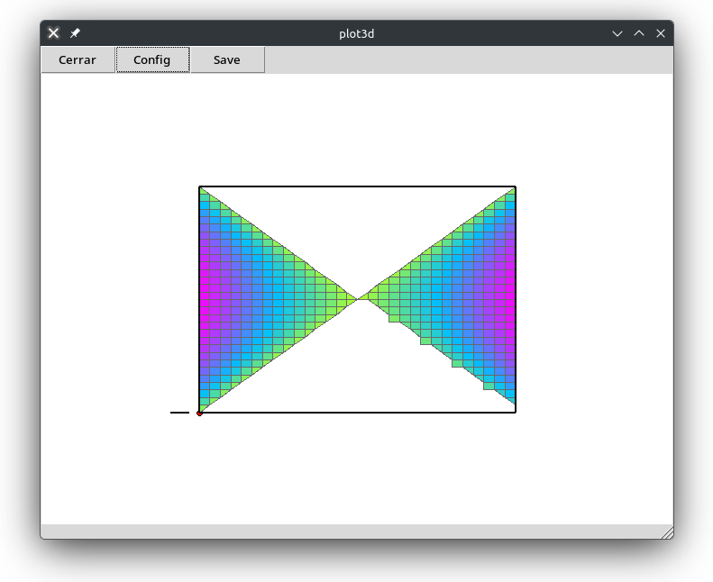
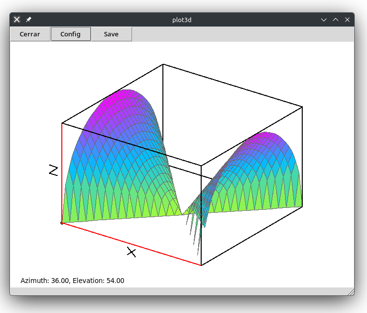

## Introducción

Una función de una variable es una regla de correspondencia que asigna a cada elemento $x$ en el subconjunto $X$ de números reales (llamado *dominio* de $f$), uno y solo un número real $y$ en otro conjunto de números reales $Y$ (llamado *rango* de $f$).

A la variable que que definamos como la que conforma el *dominio* le conocemos como la **variable independiente**, mientras que la variable incluída en el conjunto $Y$ se le nombra **variable dependiente**.

---

Una función de dos variables es una regla de correspondencia que asigna a cada par de números reales ($x$, $y$), uno y solo un número real $z$ dentro del conjunto de valores $R$, correspondientes a la variable dependiente.

Solo debe haber una variable dependiente mientras puede haber infinidad de independientes.

## Funciones polinomiales y racionales

Una **función polinomial** de dos variables consiste en la suma de potencias $x^m y^n$, donde $m$ y $n$ son enteros no negativos. Por ejemplo:

$$f(x,y)=xy-5x^2+9$$

El cociente de dos funciones polinomiales se denomina **función racional**. Por ejemplo:

$$f(x,y)=\frac{1}{xy-3y}$$

---

El dominio de una función polinomial es el plano $xy$ completo.

El dominio de una función racional es el plano $xy$, excepto los pares de números que vuelvan nulo al denominador.

---

Hagamos un breve repaso de las funciones simples, para así pasar a las de varias variables. Por ejemplo, tomemos la función $f(x)=3x^2+4x$ y evaluemos $f(5)$ y $f(-7)$:

$$
f(5)=3(5)^2+4(5)=75+20=95
$$

$$
f(-7)=3(-7)^2+4(-7)=147-28=119
$$

## Intro a Maxima

Maxima es un paquete informático para realizar operaciones matemáticas simbólicas de alto nivel. Puede instalarse tras descargarlo desde el listado disponible en [https://maxima.sourceforge.io/](https://maxima.sourceforge.io/).

Al ejecutar Maxima veremos que aparece el *prompt* `(%i1)`, lo cual significa *input 1*. Cada que debamos introducir un comando, se mostrará dicho prompt.

Cuando Maxima devuelva algún resultado, lo mostrará con `(%o1)`, el cual implica naturalmente *output 1*.

---

El comando para definir una función simple se muestra enseguida (debemos presionar  o  para ejecutar cada comando):

```maxima
(%i1)   f(x) := 3*x^2 + 4*x;
```

Maxima devuelve lo que entiende, lo cual nos permite corroborar que se corresponda con lo que quisimos decirle:

```maxima
                                         2
(%o1)                         f(x) := 3 x  + 4 x
```

Y para valuar la función, escribimos:

```maxima
(%i2)   f(5);
```

Obteniendo:

```maxima
(%o2)   95
```

---

Si en algún momento deseamos borrar una asignación, debemos *matar* la función o variable:

```maxima
(%i3)   kill(f);
```

O si deseamos directamente borrar toda asignación:

```maxima
(%i4)   kill(all);
```

## Dominio y rango de una función bivariable

1. Dada $f(x,y) = 4 + \sqrt{x^2 - y^2}$, encontremos $f(1,0)$, $f(5,3)$ y $f(4,-2)$.
2. Grafiquemos el dominio de la función.
3. Obtengamos el rango de la función.

---

R1. Escribimos en Maxima lo siguiente:

```maxima
(%i1) f(x,y) := 4+sqrt(x^2 - y^2);
                                              2    2
(%o1)                    f(x, y) := 4 + sqrt(x  - y )
```

Y vamos resolviendo para cada par:

```maxima
(%i2) f(1,0);
(%o2)                                  5
(%i3) f(5,3);
(%o3)                                  8
(%i4) f(4,-2);
(%o4)                            2 sqrt(3) + 4
(%i5) f(4,-2), numer;
(%o5)                          7.464101615137754
```

---

R2. Para representar gráficamente el dominio de la función, generaremos el gráfico pero lo visualizaremos solo desde la perspectiva de las variables independientes ($x,y$).

```maxima
(%i6)	plot3d(f(x,y), [x,-10,10], [y,-10,10], [plot_format, xmaxima]);
```

Aparecerá una ventana nueva en la que podremos rotar el gráfico hasta visualizar solo los ejes $x$ y $y$ o bien, presionar el botón `Config` y modificar `Azimuth` y `Elevation` a 0 para conseguir la vista deseada.

---



---

R3. Para representar el rango de la función, basta con rotar el gráfico obtenido anteriormente de manera que veamos la forma tridimensional.


