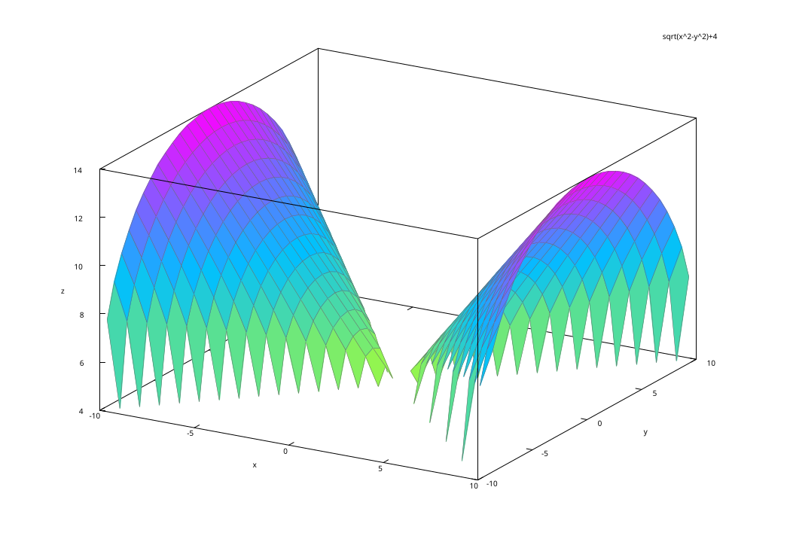
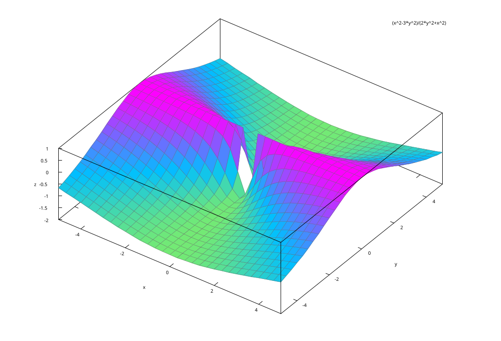

# Fundamentos de las funciones

## Introducción

Una función de una variable es una regla de correspondencia que asigna a cada elemento $x$ en el subconjunto $X$ de números reales (llamado *dominio* de $f$), uno y solo un número real $y$ en otro conjunto de números reales $Y$ (llamado *rango* de $f$).

A la variable que que definamos como la que conforma el *dominio* le conocemos como la **variable independiente**, mientras que la variable incluída en el conjunto $Y$ se le nombra **variable dependiente**.

---

Una función de dos variables es una regla de correspondencia que asigna a cada par de números reales ($x$, $y$), uno y solo un número real $z$ dentro del conjunto de valores $R$, correspondientes a la variable dependiente.

Solo debe haber una variable dependiente mientras puede haber infinidad de independientes.

## Funciones polinomiales y racionales

Una **función polinomial** de dos variables consiste en la suma de potencias $x^m y^n$, donde $m$ y $n$ son enteros no negativos. Por ejemplo:

$$f(x,y)=xy-5x^2+9$$

El cociente de dos funciones polinomiales se denomina **función racional**. Por ejemplo:

$$f(x,y)=\frac{1}{xy-3y}$$

---

El dominio de una función polinomial es el plano $xy$ completo.

El dominio de una función racional es el plano $xy$, excepto los pares de números que vuelvan nulo al denominador.

---

Hagamos un breve repaso de las funciones simples, para así pasar a las de varias variables. Por ejemplo, tomemos la función $f(x)=3x^2+4x$ y evaluemos $f(5)$ y $f(-7)$:

$$
f(5)=3(5)^2+4(5)=75+20=95
$$

$$
f(-7)=3(-7)^2+4(-7)=147-28=119
$$

## Intro a Sympy

Sympy es una librería de *Python* que sirve para realizar operaciones matemáticas simbólicas de alto nivel. Puede instalarse utilizando el comando recomendado para el sistema operativo que usemos. Por ejemplo, para Windows:

```bash
pip install sympy
```

Al tenerla instalada, podemos cargar Sympy de la manera usual:

```{python}
#| echo: True
import sympy
```

---

Los comandos necesarios para crear una función en Sympy pasan por crear primero la variable simbólica. Para ello, primero:

```{python}
#| echo: True
# Importamos lo necesario
from sympy import symbols

# Creamos la variable simbólica
x = sympy.symbols('x')

# Creamos la expresión matemática
expr_f = 5 / x

# Y la volvemos función
f = sympy.Lambda(x, expr_f)
```

---

Y para valuar la función, escribimos su nombre con el valor de la variable independiente como argumento:

```{python}
#| echo: True
# Valúemos para f(15)
f(15)
```

Podemos expresar el resultado sin que sea una fracción:

```{python}
#| echo: True
# Escribimos el resultado con tres decimales
sympy.N(f(15),3)

```

## Dominio y rango de una función bivariable

1. Dada $f(x,y) = 4 + \sqrt{x^2 - y^2}$, encontremos $f(1,0)$, $f(5,3)$ y $f(4,-2)$.
2. Encontremos el dominio de la función.
3. Obtengamos el rango de la función.

---

Primero preparemos la función simbólica:

```{python}
#| echo: True
# Cargamos lo necesario
import sympy as sp

# Creamos las variables simbólicas
x = sp.symbols('x')
y = sp.symbols('y')

# Creamos la expresión
expr = 4 + sp.sqrt(x**2 - y**2)

# Creamos la función simbólica
f = sp.Lambda((x,y), expr)
```
---

Valuemos la función para los tres pares de valores propuestos:

```{python}
#| echo: True
# Valuamos para f(1,0)
f(1,0)
```

```{python}
#| echo: True
# Para f(5,3)
f(5,3)
```

```{python}
#| echo: True
# Y para f(4,-2)
sp.N(f(4,-2),3)
```

---

Para los puntos 2 y 3, tendremos que confiar en nuestra capacidad de análisis, ya que Sympy no puede graficar funciones bivariables ni calcular el dominio y rango de estas funciones.

---

Lo que sí puede es encontrar las singularidades de la función para cada variable:

```{python}
#| echo: True
print("Singularidades respecto x: ", sp.calculus.singularities(f(x,y), x))
print("Singularidades respecto y: ", sp.calculus.singularities(f(x,y), y))

Rx = sp.calculus.util.function_range(f(x,1), x, sp.Reals)
Ry = sp.calculus.util.function_range(f(1,y), y, sp.Reals)
Ryn = sp.calculus.util.function_range(f(-1,y), y, sp.Reals)
display(Rx)
display(Ry)
display(Ryn)
```

---

## Intro a Maxima

Contrario a Python, Maxima es un paquete especializado en cálculo simbólico, por lo que sí puede calcular dominios y rangos para funciones multivariable. Veamos una breve introducción con los comandos más útiles.

Para definir una función y valuarla, hacemos lo siguiente:

```maxima
f(x,y) := 4 + sqrt(x^2 - y^2);
```

Y al ejecutar la orden Maxima nos devolverá lo que entendió. Notemos que si estamos en *wxMaxima* (lo más común si trabajamos en Windows), el comando es . Si coincide con lo que queremos decir, estamos listos.

---

Para ver cómo valuar funciones en Maxima, hagámoslo con uno de los propuestos anteriormente, encontremos $f(4,-2)$.

```maxima
f(4,-2);
```

Al ejecutar nos devolverá $2\sqrt{3}+4$. Si deseamos que Maxima nos dé valores *numéricos*, debemos agregar el argumento `numer`:

```maxima
f(4,-2), numer;
```

---

Si deseamos modificar una función, solo debemos volver a ejecutarla. Si deseamos borrar una función de memoria, debemos *matarla*:

```maxima
kill(f);
```

Y si deseamos borrar el entorno completo, lo *matamos* todo:

```maxima
kill(all);
```

## Gráficas en Maxima

Muy útiles para deducir el dominio y rango de funciones. Para nuestro ejemplo, podríamos probar con

```maxima
plot3d(f(x,y), [x, -10, 10], [y, -10, 10]);
```

Devolviendo:




# Límites

## Introducción

En funciones simples, la existencia del límite puede calcularse de varias formas, dependiendo de si la función es continua o no. Si lo es, la mera sustitución de valores funciona para confirmar (o no) su existencia.

Recordemos que la existencia de un límite se confirma si la aproximación *por todas trayectorias* da el mismo valor $L$.

## Límites de funciones bivariables

En funciones bivariables, la definición de la existencia de un límite implica comprobar que obtenemos un mismo valor $L$ tras *acercarnos* siguiendo dos trayectorias diferentes. Un par de rutas aceptable, pero no el único, es seguir los ejes $x$ y $y$. Veamos un ejemplo.

Ejemplo 1. Demostremos que no existe el límite:

$$
\lim_{(x,y) \to (0,0)} \frac{x^2-3y^2}{x^2+2y^2}
$$

---

Sustituyendo los valores a los que tiende cada variable obtenemos:

$$
\lim_{(x,y) \to (0,0)} \frac{x^2-3y^2}{x^2+2y^2}=\frac{0}{0}
$$

Esto, aunque parezca cumplir la condición, no lo hace. Recordemos que la división por cero no existe, por lo que este resultado no nos permite una conclusión.

Cambiemos el enfoque.

---

Hagamos la sustitución de una variable a la vez, es decir, acercarnos siguiendo los ejes coordenados. Primero con $y$:

$$
\lim_{(x,0) \to (0,0)} f(x,0) = \lim_{(x,0) \to (0,0)} \frac{x^2-0}{x^2+0}=1
$$

Ahora con $x$:

$$
\lim_{(0,y) \to (0,0)} f(0,y) = \lim_{(0,y) \to (0,0)} \frac{0-3y^2}{0+2y^2}=-\frac{3}{2}
$$

Podemos confirmar que el límite no existe, pues ambos resultados son diferentes.

---

Confirmando con Maxima (ejecutar cada comando individualmente):

```maxima
g(x,y) := (x^2 - 3*y^2) / (x^2 + 2*y^2);
limit(g(x,y),y,0);
limit(g(x,y),x,0);
plot3d(g(x,y), [x,-5,5],[y,-5,5]);
```



## Ejemplo 2 (sustitución)

Demostremos que el límite no existe

$$
\lim_{(x,y) \to (0,0)} \frac{xy}{x^2+y^2}
$$

Podemos probar con el enfoque anterior. No funcionará. Recordemos que una recta se define por $y=mx$.

## Ejemplo 3

Demostremos que el límite no existe

$$
\lim_{(x,y) \to (0,0)} \frac{x^3y}{x^6+y^2}
$$

## Ejemplo 4

Evalúe:

$$
\lim_{(x,y) \to (2,3)} f(x+y^2)
$$

