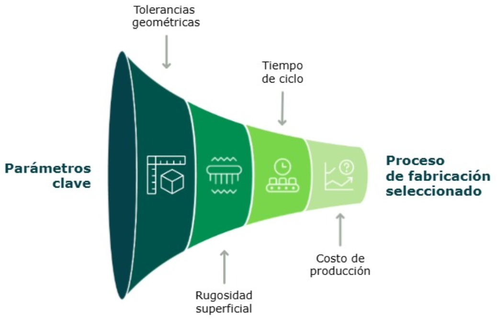
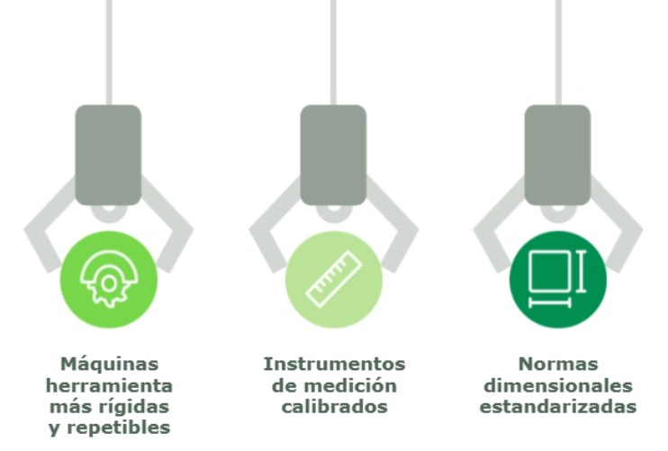

## 1.1 Definición y alcance {.smaller}

La ingeniería de precisión es la disciplina que integra diseño, manufactura, metrología y control estadístico con el propósito de producir componentes y sistemas que cumplan con especificaciones dimensionales y geométricas estrictas, bajo estándares internacionales ISO y ASME (Henzold, 2020). Su enfoque no se limita únicamente a fabricar piezas con medidas exactas, sino a controlar la variabilidad del proceso completo, desde la selección del material hasta la validación final.

En un entorno industrial moderno, la precisión implica considerar múltiples variables interrelacionadas:

- Materiales: propiedades mecánicas, estabilidad dimensional, comportamiento térmico y acabado superficial
- Maquinaria: capacidad de repetibilidad, resolución, rigidez estructural y control numérico
- Herramientas: durabilidad, desgaste, estabilidad en corte y exactitud en posicionamiento

##

La selección del proceso no depende únicamente de "fabricar una pieza", sino de garantizar que esta cumpla con parámetros como:

##

Por lo tanto, el alcance de la ingeniería de precisión abarca:

1. Diseño dimensional funcional.
2. Definición de tolerancias y especificaciones técnicas.
3. Implementación de sistemas y verificación.
4. Integración de tecnologías digitales para monitoreo y mejora continua.

La precisión se convierte en un sistema integral de aseguramiento de calidad, más que una simple característica dimensional.

## Historia y evolución

La evolución de la ingeniería de precisión está directamente relacionada con el desarrollo de los procesos de manufactura. En sus inicios, la producción artesanal dependía de la habilidad manual del operario, lo que generaba alta variabilidad entre piezas.

Con la Revolución Industrial surgió la necesidad de la intercambiabilidad de componentes, especialmente en la industria armamentista y, posteriormente, en la automotriz.

##

Este cambio impulsó el desarrollo de:

##

Durante el siglo XX, con el desarrollo del control estadístico de procesos, se comprendió que la variabilidad no puede eliminarse completamente, pero sí controlarse dentro de límites aceptables (Montgomery, 2019). Más adelante, la automatización, el control numérico computarizado (CNC) y las máquinas de medición por coordenadas (CMM) transformaron radicalmente la forma de garantizar la precisión.

## Aplicaciones en la industria {.smaller}

La ingeniería de precisión tiene aplicaciones estratégicas en múltiples sectores industriales, en los que pequeñas desviaciones pueden generar fallas críticas. El cumplimiento de tolerancias geométricas garantiza la funcionalidad y el ensamblaje adecuado de componentes críticos (Henzold, 2020).

## Aplicaciones en la industria {.smaller}

La ingeniería de precisión tiene aplicaciones estratégicas en múltiples sectores industriales, en los que pequeñas desviaciones pueden generar fallas críticas. El cumplimiento de tolerancias geométricas garantiza la funcionalidad y el ensamblaje adecuado de componentes críticos (Henzold, 2020).

##

##

## {.smaller}

En todos estos sectores, los parámetros clave de desempeño incluyen:

- Cumplimiento de tolerancias geométricas.
- Control de rugosidad superficial.
- Optimización del tiempo de ciclo.
- Balance entre precisión y costo.

Asimismo, las tendencias actuales muestran que la manufactura moderna integra materiales avanzados, automatización inteligente y modelos organizacionales ágiles, orientados a reducir desperdicios y mejorar la competitividad. El análisis estadístico de la variación permite optimizar procesos y reducir defectos en producción (Montgomery, 2019).

La ingeniería de precisión, por tanto, no solo garantiza calidad técnica, sino que impacta directamente en la productividad, sostenibilidad y posicionamiento global de las empresas.

## Cierre

La ingeniería de precisión representa mucho más que la fabricación de piezas con medidas exactas; es una disciplina que integra diseño, selección de materiales, procesos de manufactura, sistemas de medición y control estadístico para garantizar que cada componente cumpla con su función dentro de un sistema mayor. A lo largo de este tema comprendiste que la precisión no depende únicamente de una máquina o un instrumento de medición, sino de la coordinación entre materiales, maquinaria, herramientas y métodos de control.

##

Asimismo, analizaste cómo esa disciplina ha evolucionado desde la producción artesanal hasta la manufactura digital, donde la automatización, los sensores inteligentes y el análisis de datos permiten monitorear procesos en tiempo real y reducir la variabilidad desde el origen. Esta evolución ha transformado la precisión en un elemento estratégico para la competitividad industrial.

##

Entender la definición, el alcance y las aplicaciones de la ingeniería de precisión constituye la base para profundizar posteriormente en herramientas específicas como las tolerancias geométricas, la metrología avanzada y el análisis estadístico. Sin estos fundamentos, sería imposible diseñar productos confiables, seguros y eficientes.

## Checkpoint

Asegúrate de:

- Identificar la simbología básica de GD&T.
- Clasificar los tipos de tolerancias geométricas.
- Reconocer la importancia de GD&T en la industria manufacturera.

## Referencias bibliográficas

- Henzold, G (2020). *Geometrical Dimensioning and Tolerancing for Design, Manufacturing and Inspection: A Handbook for Geometrical Product Specification Using ISO and ASME Standards* (3a ed.). Reino Unido: Butterworth-Heinemann.
- Montgomery, D (2019). *Introduction to Statistical Quality Control* (8a ed.). EE.UU.: Wiley.
