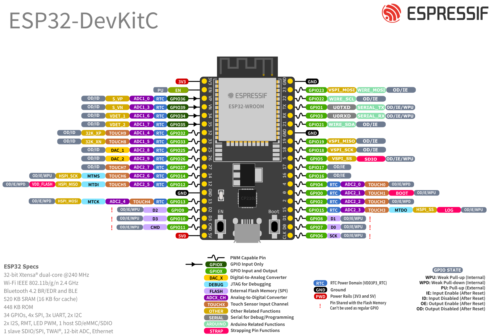

## Encuadre Unidad 1

**Introducción a los Sistemas Embebidos**

Se evalúa con:

- Reporte de prácticas en clase (~12 prácticas).
- Primer Avance del Proyecto de Asignatura.
- Tienen dos oportunidades para cumplir con sus evidencias.
- El mínimo de asistencia es el 80%. Por debajo de ese porcentaje Moodle les bloqueará la entrega.

## Encuadre Unidad 2

**Internet de las Cosas**

Se evalúa con:

- Reporte de prácticas en clase (~5 prácticas).
- Segundo Avance del Proyecto de Asignatura.
- Tienen dos oportunidades para cumplir con sus evidencias.
- El mínimo de asistencia es el 80%. Por debajo de ese porcentaje Moodle les bloqueará la entrega.

## Encuadre Unidad 3

**Aplicaciones**

Se evalúa con:

- Proyecto de Asignatura **funcional** y su Documentación.
- Presentación del Proyecto ante autoridades y Póster de Divulgación (*90x120 cm*).
- Tienen dos oportunidades para cumplir con sus evidencias, exceptuando la presentación y el póster, los cuales deben realizarse en la fecha estipulada.
- El mínimo de asistencia es el 80%.

## Sistemas Embebidos

Son dispositivos diseñados para ejecutar tareas concretas mediante cómputo, pero con recursos limitados y bajos consumos energéticos. No están diseñados para la multitarea.

Su nombre viene por estar embebidos en otros sistemas más complejos, como electrodomésticos o coches.

## Tipos de sistemas embebidos

Tenemos los microcontroladores (MCU) y los microprocesadores (MPU).

Los primeros ya cuentan con todo lo necesario para funcionar en una sola placa o chip (CPU, memoria volátil y permanente, entradas y salidas, interfaces) y son más limitados en capacidad de procesamiento y memoria. Debido a ello, su consumo energético es muy bajo.

## Ejemplos de MCU

- AVR: ATMega 328 (Arduino Uno)
- PIC
- ARM
- ESP: ESP8266 o ESP32

## Ejemplos de MPU

- Broadcom (Raspberry Pi 3)
- Qualcomm (Snapdragon)
- Intel Atom
- MediaTek SOCs

## Comparativa entre un MCU y un MPU {.smallest}

| Modelo | CPU | Rango de frecuencia | Memoria típica |
|---|---:|---|---:|---|
| ATmega328P | 8‑bit AVR | 16 MHz | 2 KB RAM / 32 KB Flash |
| Raspberry Pi (BCM2711, Pi 4) | ARM Cortex‑A72 (quad) | 1.5–1.8 GHz | 1–8 GB RAM / SD/eMMC (según modelo) |

## ESP32

